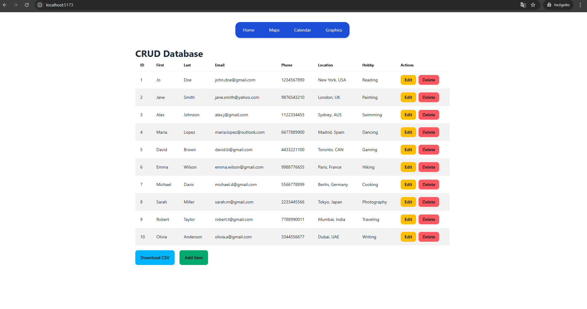
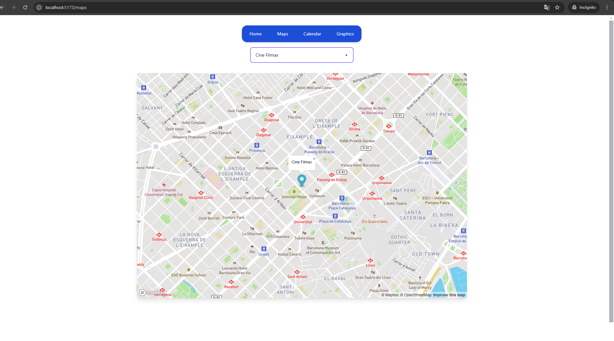
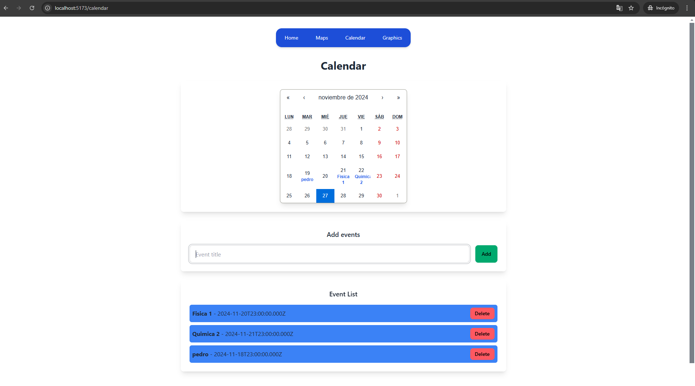
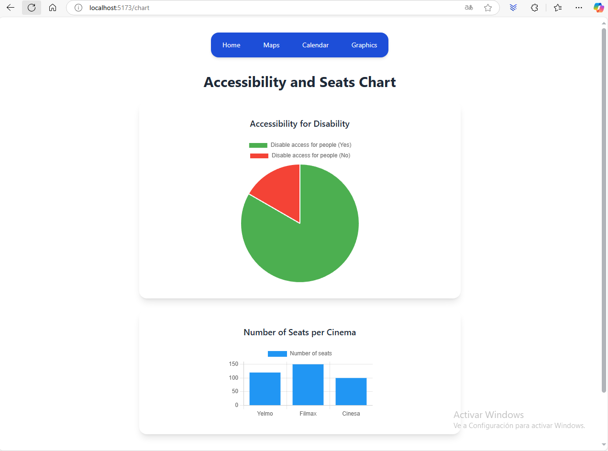
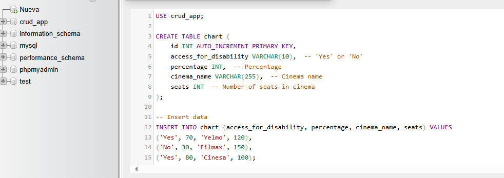

# React Application with MySQL Integration

This project is a React-based web application that showcases a dynamic table, an interactive map, a calendar, and visual charts. The application interacts with a **MySQL database** (created using **phpMyAdmin**) through a backend **API** (`server.js`) to fetch, display, and manage data. Additionally, the application incorporates **Mapbox API** for map functionality and uses **Chart.js** for data visualization.

Below is an example:

## 📖 Features

- **Dynamic Table**: A CRUD interface to manage database entries with sorting and filtering capabilities.

- **Interactive Map**: Displays cinemas on a map using the **Mapbox API** and provides detailed location information.

- **Calendar**: Enables users to add, view, and delete events stored in the MySQL database.

- **Charts**: Visualizes data with a **Pie Chart** and a **Bar Chart** to represent accessibility and cinema seating data.

- **Routing**: Uses `react-router-dom` for seamless navigation between components.

## 📋 Requirements
To run this project, ensure you have the following installed:
- **Node.js** (v16 or higher)
- **npm** or **yarn**
- **MySQL**
- **phpMyAdmin** (for database management)
- **Mapbox API key** (for map integration)

---

## 🛠 Installation

1. **Clone the repository**:
   
    git clone https://github.com/marcos-react/S8.Inprocode-React-.git
    cd S8.Inprocode-React

2. **Install dependencies**:

    npm install

3. **Set up the MySQL database**:

    Create a database called crud_app in phpMyAdmin.
    Import the required tables for the application (e.g., chart, cinemas, events).
    Populate the tables with initial data.

4. **Set up the environment**:

    Add your Mapbox API key to src/components/MapsPage/MapsContainer.jsx or env file 
    Configure your MySQL database credentials in server.js.

## How to run the application:

1. **Start the backend API**:

    node src/midleware/server.js

2. **Start the React application**:

    npm start

3. **Open your browser and navigate to**:

    http://localhost:5173

## Project Structure

    react-mysql-app/
    ├── public/                  # Static assets
    ├── src/
    │   ├── components/          # React components
    │   │   ├── Header/          # Navigation header
    │   │   ├── CalendarPage/    # Calendar functionality
    │   │   ├── ChartPage/       # Charts and visualizations
    │   │   ├── MapPage/         # Interactive Mapbox map
    │   │   └── TablePage/       # CRUD table interface
    │   ├── App.jsx              # Main routing configuration
    │   ├── main.jsx             # Application entry point
    │   |── pages/               # Pages folder of WelcomePage, MapsPage, UserForm, etc.   
    ├── middleware/server.js     # Backend API (Node.js + Express)
    ├── package.json             # Project metadata and dependencies
    └── README.md                # Project documentation

## How to Use

1. **Navigate between the app sections using the header menu.**

2. **Table**:

        Add, edit, or delete records in the table using the form and buttons provided.

3. **Map**:

        View cinema locations on an interactive map.
        Select a cinema to view its details.

4. **Calendar**:

        Add events by selecting a date and filling out the event form.
        Delete events from the event list.

5. **Charts**:

        View accessibility data in a pie chart.
        Visualize cinema seating data in a bar chart.

## Technologies 

**Front End**

    **React**: JavaScript library for building the UI.
    **React Router DOM**: Routing for navigating between pages.
    **DaisyUI**: TailwindCSS-based component library for styling.
    **Chart.js**: For visualizing data in pie and bar charts.
    **Mapbox API**: Interactive maps for cinema location data.

**Backend**

    **Node.js**: JavaScript runtime for server-side programming.
    **Express.js**: Framework for building the RESTful API.
    **MySQL**: Relational database for storing application data.
    **phpMyAdmin**: Database management for MySQL.
    **Axios**: HTTP client for making API requests
